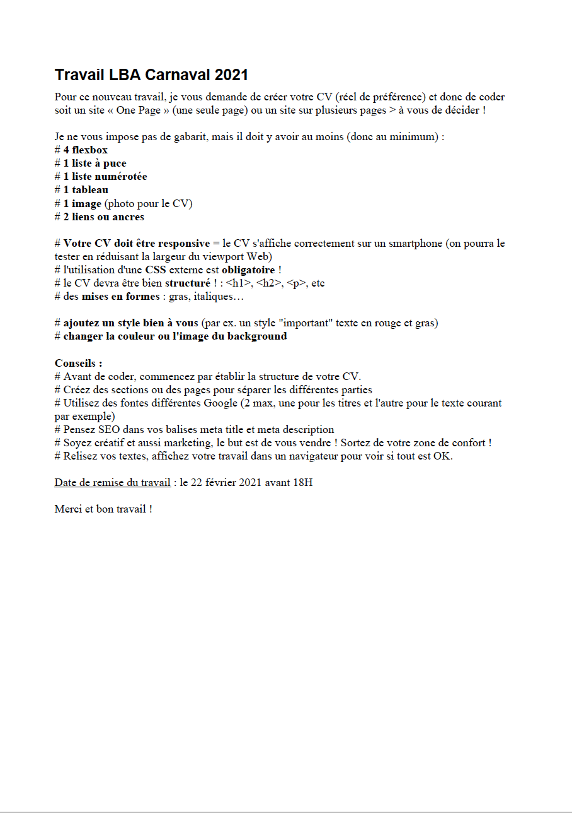

# Update project : Curriculum Vitea Rekha Lambotte
Update du CV pour un nouveau projet

## Cadre:
Cet exercice est effectué dans le cadre de ma formation au centre de formation IFAPME. 
Nous sommes en février 2021.

## Instructions:

## Projet déployé: 
Lien Github : https://github.com/RekhaLambotte/CV-Rekha.git

Lien web:  https://rekhalambotte.github.io/CV-Rekha/

## Remarques:
Aucun changement sur les autres points ci-dessous.

Maintenant que j'ai acquis plus d'expérience, j'ai vraiment passé un bon moment à faire ce projet.

===================================================================

# Curriculum Vitea Rekha Lambotte
Exerxice de HTML-CSS

## Cadre:
Cet exercice est effectué dans le cadre de ma deuxième semaine de formation au centre de formation BECODE. 
Nous sommes en janvier 2021.

## Technos utilisées:
HTML5
CSS3

## Auteurs: 
Juste moi :)

## Instructions:
Pour cet exercice le but est de créer un CV 
Délai: 4 heures

## Statut:
Terminé

## Projet déployé: 
Lien Github : https://github.com/RekhaLambotte/CV-Rekha.git

Lien web:  https://rekhalambotte.github.io/CV-Rekha/

## Remarques:
Le delai est encore trop juste pour moi.
J'ai eu quelques complications avec l'image du background et la responsivité. 
Grace a cette exercice j'ai decouvert beaucoup de balises.
